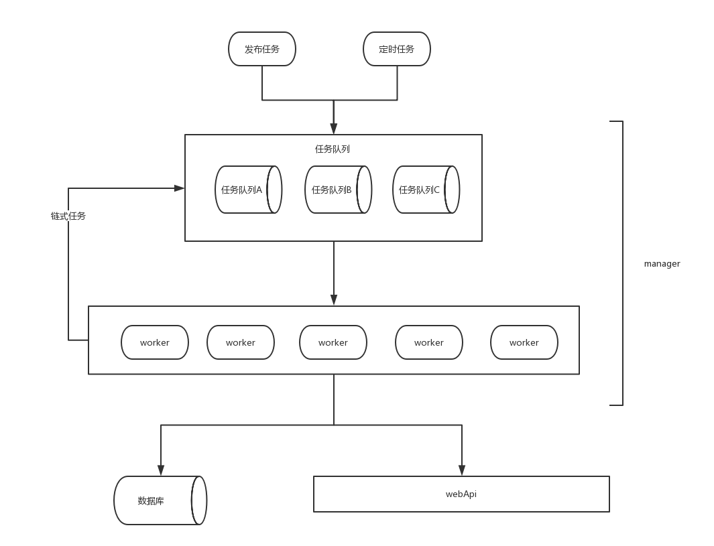
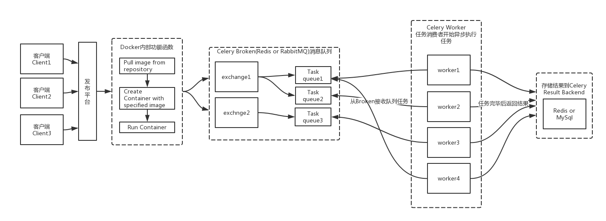
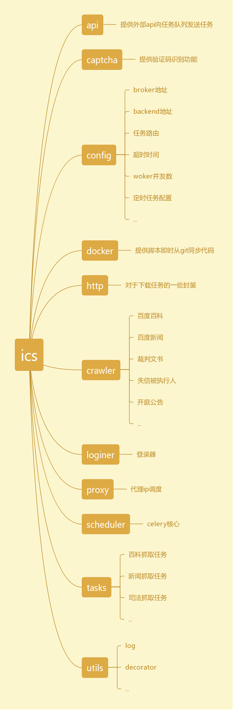
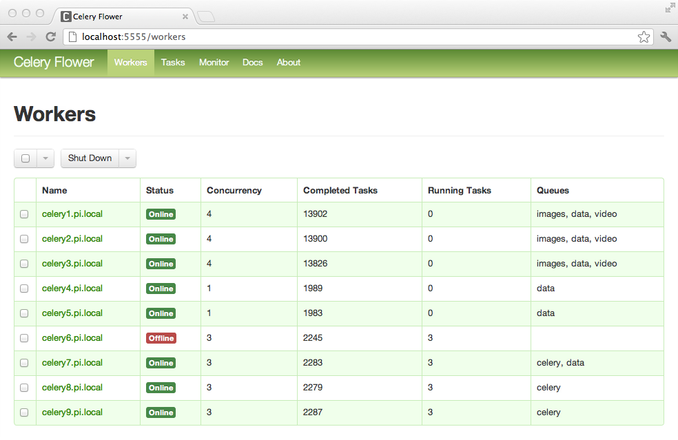
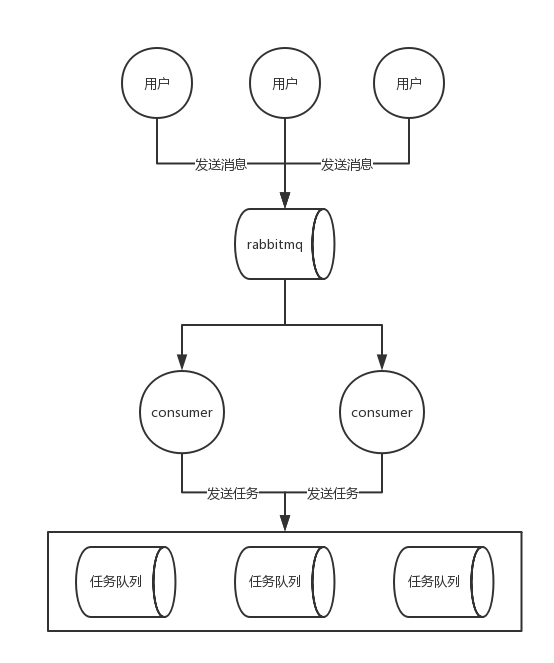
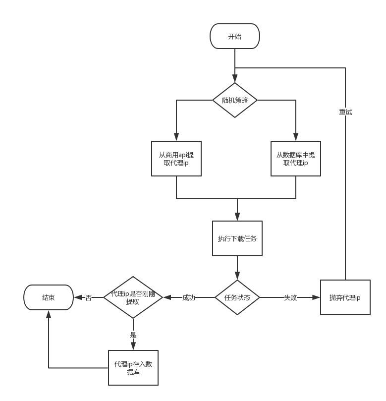

# ICS
## 简介
全称 Icekredit Crawler System。

为了让爬虫系统健壮、稳定、可伸缩、可扩展，满足高并发，规范爬虫编写方式，简化开发流程，并且符合各种需求，基于celery设计了这个分布式的爬虫系统。


## 运行环境
python2.7，后续根据情况适配python3


## 基本流程
<div align=left></div>
* 提供外部接口或主动将任务发布到任务队列；
* worker根据调度和路由从任务队列中取得任务并执行任务；
* 执行任务完毕后，根据逻辑继续向任务队列中发布任务，或将数据入库


## 采用技术栈
   * rabbitmq -- 消息传递媒介
   * celery -- 任务队列实现 [【文档】](http://docs.celeryproject.org/en/latest/index.html# "文档")
   * flower -- 任务队列监控，三方api控制队列
   * supervisor -- 管理woker进程

## celery介绍及特性


* 方便查看任务的执行情况, 如 是否成功, 当前状态, 执行任务花费的时间等；
* 支持**定时任务**;
* 使用功能齐备的管理后台或命令行添加,更新,删除任务；
* 方便把任务和配置管理相关联；
* 提供错误处理机制（on_success,on_false,on_retry,ack_late...）；
* 支持队列优先级；
* 支持任务路由；
* 提供多种任务原语, 方便实现任务分组,拆分,和调用链；
* 支持多种消息代理和存储后端；


## 目录结构
<div align=left></div>


## 监控
Flower是Celery官方推荐的实时监控工具，用于监控Tasks和Workers的运行状态。Flower提供下列功能：

* 查看 Task 清单、历史记录、参数、开始时间、执行状态、异常信息等;
* 统计队列中任务总数，执行成功、失败、重试等状态的任务数量;
* 撤销、终止任务;
* 查看 Worker 清单、状态;
* 远程开启、关闭、重启 Worker 进程;
* 提供 HTTP API，方便集成到运维系统;
* 相比查看日志，Flower 的 Web 界面会显得更加友好;




[【flower文档】](https://flower.readthedocs.io/en/latest/ "flower文档")
[【flower API】](https://flower.readthedocs.io/en/latest/api.html "flower API")


## 管理进程
采用supervisor管理worker进程。支持进程挂掉后自动重启进程。


## 简单示例
* 在**ics/task/**下新建爬虫任务package**baidu_news**,并在该目录下新建任务文件**task.py**
* 新建一个任务**start**

```python
@app.task
def start(crawl_request):
    for request in [Request(url="http://news.baidu.com/ns?word={0}&pn={1}&cl=2&ct=1&tn=news&rn=20&ie=utf-8&bt=0&et=0"
            .format(crawl_request['keyword'], 20 * page), meta=crawl_request,
                            callback='ics.task.baidu_news.task.process') for page in range(1, 2)]:
        send_download_request(request, baidu_news_queue)
```

* 其中crawl_request是一个爬取请求，其中包含了这次需要爬取的信息，比如关键字。
* 利用这个关键字构造Request对象，利用send_download_request方法将这个对象发送到下载队列中。
* callback是一个回调函数，意思是当这个request对象下载完成后，会得到一个response，再将这个response作为参数发送到ics.task.baidu_news.task.process这个函数中进行执行。
* 然后继续新建一个任务**process**

```python
@app.task
def process(response):
    response = response_from_dict(response)
    soup = response.get_soup()
    content_list = soup.select('div.result')

    for content in content_list:
        result_mysql = dict()
        title = content.select('h3')[0].text.strip()
        content_0 = content.select('p.c-author')[0].text.replace('\n', '').replace('\t', '')
        from_ = content_0.split('  ')[0]
        date = content_0.split('  ')[1]
        temp_content = content.select('div.c-summary.c-row')[0]
        temp_content.p.clear()
        content_ = temp_content.text.strip().replace('\n', '').replace('\t', '') \
            .replace('...      查看更多相关新闻>>  -                                            百度快照', '...') \
            .replace('...                      百度快照', '...')

        url = content.select('h3 a')[0]['href'].strip()

        result_mysql['company_name'] = response.request.meta['companyName']
        result_mysql['uuid'] = response.request.meta['uuid']
        result_mysql['crawl_task_id'] = response.request.meta['crawlTaskId']
        result_mysql['keyword'] = response.request.meta['keyword']
        result_mysql['searcher'] = 'baidu'
        result_mysql['snapshot_source'] = from_
        result_mysql['title'] = title
        result_mysql['url'] = url
        result_mysql['content'] = content_
        result_mysql['snapshot_date'] = date.split(' ')[0].replace('年', '-').replace('月', '-').replace('日', '')

        if response.request.meta['need_content']:
            response.request.meta['searcher'] = 'baidu'
            response.request.meta['snapshot_source'] = from_
            response.request.meta['snapshot_date'] = date.split(' ')[0].replace('年', '-').replace('月', '-').replace('日',
                                                                                                                    '')
            response.request.meta['title'] = title
            send_download_request(
                Request(url=url, meta=response.request.meta, callback='ics.task.baidu_news.task.get_content'),
                queue=baidu_news_queue)
        else:
            insert_mysql("sentiment_snapshot", result_mysql)
```

* 最开始获取到的response是一个json，我们通过response\_from\_dict(response)将response转化为更常用的response对象
* 然后从response中获取我们需要的返回结果并且解析
* 最后用insert_mysql方法将结果入库
* 可以通过**response.request**获取本次下载所用的request，并从**request.meta**中获取最开始向后传递的数据
* 整个爬虫编写完成后，使用命令**celery -A ics worker -Q task_queue -l info**即可启动worker执行task_queue中的任务


## 调试
* 配合django-celery支持本地断点调试worker任务


## 发送任务方式
```python
app.send_task('ics.task.test.task.add', [i, 3], queue='test_queue', priority=2)
```

```python
from ics.task.test.task import multi

multi.apply_async(args=(2, 2),queue='tasks', priority=2)
```

## 接收外界任务方式



* 以特定规则向消息队列发送任务请求，例如 { "task_name": "crawl_news", "keyword": "冰鉴" }；
* 由特定节点从消息队列获取请求并构建完整任务请求发送至任务队列；


## 任务暂停/继续
* 若产生异常譬如监测到有验证码弹出则采用以下方式将任务暂停

```python
app.control.rate_limit('ics.task.test.task.add', '0/m')
```

* 暂停后发送信号执行已封装好的识别验证码任务，执行成功后恢复任务执行

```python
app.control.rate_limit('ics.task.test.task.add', '120/m')
```

* 其中**120/m**代表任务执行速率是每分钟执行120次


## 支持设置
* 最大重试次数
* 任务运行速率
* 重试等待时间
* 任务超时时间
* 任务优先级

[【更多设置】](http://docs.celeryproject.org/en/latest/userguide/configuration.html "【更多设置】")


## 部署
* 一台服务器上部署rabbitmq + flower；
* 数台服务器上部署worker；
* 每个服务器上保存一份ics代码并与生产代码库保持更新；
* 每个服务器上部署数个dokcer容器，容器内运行单个worker节点，docker挂载外部ics代码；


## 软件环境
* Dokcer
* Python2.7
* Celery
* Flower


## 报警机制
* 每个爬虫编写测试用例，每天定时运行检查爬虫是否需要维护。若需要维护则发送邮件通知开发人员。


## 数据清洗
* 在爬虫任务中，尽量不要提取字段，将完整访问内容，访问地址等等信息全部保存到数据库；
* 另外新建 ETL 任务解析字段，清洗数据；
* 即时清洗流程
    * 即时清洗意为每获取到原始数据，立即发起数据清洗任务；
    * 在 task 包下的相应爬虫任务包例如 ics.task.zgcpws 下新建包 etl ；
    * 在 ics.task.zgcpws.etl 下新建 task.py 并写入清洗数据任务代码；
    * 存入的原始数据每条数据应有 source_id，etl_time 和 etl_status，etl_status 初始为 origin ；
    * 每存入一条原始数据，向 queue_zgcpws_etl 队列中发起清洗数据任务，传入原始数据的表名和 source_id ；
    * worker 清洗结束后，更新原始数据的 etl_status = success/failed，并更新数据清洗结束时间 etl_time ；
* 延时清洗流程
    * 延时清洗意为每获取到原始数据，并不立即发起数据清洗任务，而以定时或手动的方式来执行数据清洗任务；
    * 在 task 包下的相应爬虫任务包例如 ics.task.zgcpws 下新建包 etl ；
    * 在 ics.task.zgcpws.etl 下新建 task.py 并写入清洗数据任务代码；
    * 存入的原始数据每条数据应有 source_id，etl_time 和 etl_status，etl_status 初始为 origin ；
    * 另外新建 start_etl.py 调用 task.py 中的清洗任务（当做函数来调用）作为完整的清洗脚本；
    * 更新原始数据的 etl_status = success/failed，并更新数据清洗结束时间 etl_time；
    * 定时启动或者手动启动 start_etl.py 执行完整数据清洗；


## 代理池维护
* 商用代理api返回结果示例

```python
{
	"code" : 0,
	"success" : true,
	"msg" : "0",
	"data" : [{
			"ip" : "49.68.68.197",
			"port" : 33220,
			"expire_time" : "2017-06-20 20:40:24",
			"city" : "徐州市",
			"isp" : "电信"
		}, {
			"ip" : "121.236.238.89",
			"port" : 33502,
			"expire_time" : "2017-06-20 20:42:15",
			"city" : "苏州市",
			"isp" : "电信"
		}
	]
}
```

* 代理IP使用流程图



* 代理IP使用流程
	* 通过商用api获取代理ip；
	* 商用代理有效期为5-1440分钟；
	* 每次爬取初始化时，从商用api获取一个有效代理ip；
	* 使用获取到的代理ip运行完整的任务链；
	* 运行过程中发现代理ip异常则抛弃；
	* 爬取结束并无异常则将代理ip存入数据库；
	* 中途根据策略随机从数据库中提取未过期的代理ip穿插使用；
	* 定期清理数据库中过期的代理ip；

## 关于列表爬取异常处理方式
* 场景：有一份较长的企业名称列表，根据这个列表爬取相应的企业数据。但是在爬取一半的时候因为网站升级或其它异常原因，导致已经发送到队列的任务无法正常运行。这时则可能需要从头开始进行爬取造成浪费。
* 处理办法
    * 为每个企业增加标识符，该标识符代表是否已经爬取结束；
    * 每个企业信息爬取结束后将标识符更新为结束状态；
    * 当在爬取过程中出现网站升级等因素造成任务失效，则停止爬虫，并升级爬虫；
    * 提取标识符为未结束的企业继续进行爬取。

## 命名规则
* 爬虫项目名称为**baidu_news**，任务描述为**crawl_news**；
* worker节点：worker_baidu_news_00，worker_baidu_news_01，worker_baidu_news_02......；
* 队列名称：queue_baidu_news；
* 任务文件名称：task_baidu_news；
* 任务名称：task_baidu_news_crawl_news；

## 任务拆分原则
* 若拆分出的任务链，每个任务只向后创建一个任务，则不必拆分；
* 若任务链中，一个任务中同时向后创建多个任务，则需要拆分；

## 规范
* 每个爬虫任务独享一个任务队列，下设一个或数个worker执行任务；
* 项目初期原则上一个爬虫一个队列，一个worker，防止过多队列和worker造成混乱，ps：每个worker都能并行计算
* 为每个任务设置优先级；
* 若爬虫入库时间较长，可以另外设置队列来专门处理入库io；
* 过于特定的爬虫，不需要将流程拆分成多个任务，在crawler模块下建立相应的爬虫模块，再在task模块下进行调用即可；
* 比较复杂的爬虫，根据特定需求将流程拆分成多个任务供worker调用；
* 若发生异常，记录详细日志比如下载url，下载结果，请求头，请求cookie，异常信息..方便排查异常原因；
* 任务若没有io，不设置重试；
* 每个爬虫都在ics/task/ 下新建文件夹，进行开发；
* 每个任务文件都以task开头，禁止混用task/tasks；
* 常用方法和工具统一封装至ics/util 下；
* 每个队列都以queue开头，并注释清楚是什么队列；
* 若有通用的task，比如入库操作，统一将task封装至ics/task/core/下；
* 若要对系统进行扩展，严格遵守将扩展程序放在相应的模块中以防止混乱；
* 不关注结果的任务，一律设置ignore_result=True；
* 爬虫未上线时在测试环境中进行调试；
* 测试完成后统一交付上线并部署worker；


